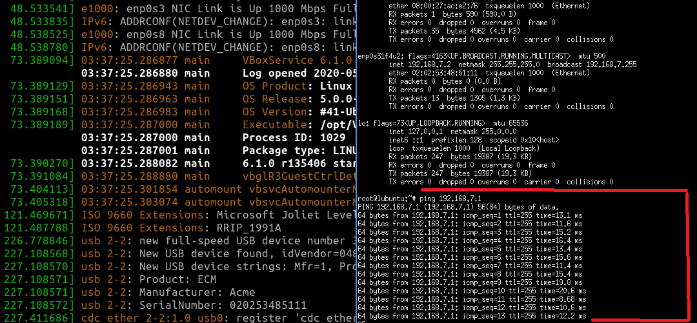

# 说明
本工程主要是迁移[https://github.com/majbthrd/stm32ecm](https://github.com/majbthrd/stm32ecm)到STM32CubeIDE。

## 迁移说明

* 利用STM32CubeIDE生成工程文件时，需要启用USB并且Device FS应当选择CDC ACM。代码生成后，设置好src文件夹中的源代码，然后取消对工程文件的USB_DEVICE和Middlewares\ST\STM32_USB_Device_Library的编译（也可以直接删除其子文件夹）。

* 根据src/src/ecm_main.h的内容将ecm_main.h中的初始化函数和处理函数放在main.c的合适位置。

# 测试结果

* 单片机: STM32F072C8T6

## 测试的OS

* Linux（lubuntu 19.04）

## 测试结果

* 网卡的枚举和识别正常

* DHCP测试不正常，因此需要手动设置IP为192.168.7.2。

* Ping 192.168.7.1正常（已启用lwip对ICMP协议的支持）

* DNS测试正常。能正常解析run.stm和www.run.stm为192.168.7.1。

* HTTP由于存储空间不足无法编译测试。
